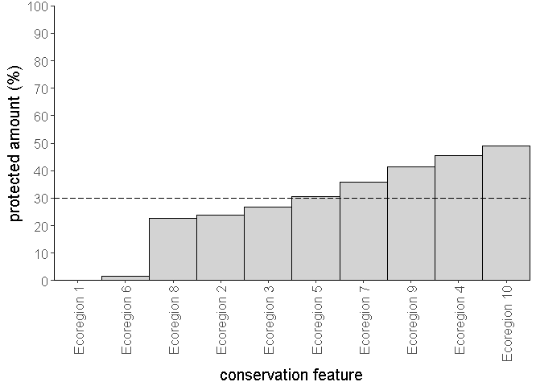

# ConsTarget
_ConsTarget_ is an R package to calculate conservation target achievement of nature reserve networks.


## Installation

The latest version of the _ConsTarget R_  package can be installed using the following R code.

```{r}
if (!require(devtools))
  install.packages("devtools")
devtools::install_github("KerstinJantke/ConsTarget")
```

## Citation

Please using the following citation to cite the _ConsTarget R_ package in publications:

Jantke, K., Kuempel, C.D., McGowan, J., Chauvenet, A.L.M., Possingham, H.P., 2018. ConsTarget: Calculate Conservation Target Achievement. R package version 0.1. Available at: https://github.com/KerstinJantke/ConsTarget


## Usage

Here we will provide a short example showing how the _ConsTarget R_ package can be used to calculate conservation target achievement. First, we will load the _ConsTarget R_ package.

```{r}
# load package
library(ConsTarget)
```
Second, we will generate example input data for 10 ecoregions. Input data for the package functions is a _dataframe_ with three columns: `feature`, `ai`, and `pi`. `feature` is the name of the conservation features (e.g. ecoregions, habitats, species), `ai` is the total amount of conservation features and `pi` is the protected amount of conservation features in our region of interest. 


```{r}
# Generate input data
feature   <- paste("Ecoregion",1:10)  #conservation feature names
ai        <- c(41,223,1053,520,230,303,343,2684,6507,1010)  #total amount of conservation features
pi        <- c(0,53,282,237,70,5,123,606,2695,496)  #protected amount of conservation features
data      <- data.frame(feature,ai,pi)  
```

Third, we will run the functions. The R package _ConsTarget_ comes with the two functions `mpg` and `mta`, which determine the degree of conservation target shortfall or achievement as values between 0 and 1. The function `mpg` calculates the Mean Protection Gap of conservation features in protected area networks (0 is no gap and 1 is 100% gap to a conservation target). The function `mta` calculates the Mean Target Achievement of conservation features in protected area networks (0 is no achievement and 1 is 100% achievement of a conservation target). Mean Protection Gap (MPG) and Mean Target Achievement (MTA) are complementary such that MPG + MTA = 1. 

The functions take three arguments: the `data`, the conservation `target` as a value between 0 and 1 (0 is 0% protection and 1 is 100% protection), and a `TRUE/FALSE` statement determining whether an automatic plot should be generated. 

```{r}
# Run the mpg function for conservation target 0.3 (30% protection of each feature)		          
mpg(data,0.3,plot=TRUE)
```

```{r}
# Run the mta function for conservation target 0.5 (50% protection of each feature)
mta(data,0.5,plot=FALSE)
```

The functions `mpg` and `mta` output four arguments and a plot: `MPG` or `MTA` is the mean protection gap or mean target achievement as a value between 0 and 1; `target` is the conservation target set; `N` is the number of conservation features; `proportion_protected` is the protected proportion of each conservation feature as values from 0 to 1, sorted from low to high. The plot shows for both metrics the protected proportion of conservation features as well as the conservation target (dashed line). 

__Example output for calculating Mean Protection Gap for a 30% conservation target:__

```{r}
> mpg(data,0.3,plot=TRUE)
$MPG
[1] 0.2507472

$target
[1] 0.3

$N
[1] 10

$proportion_protected
   conservation_feature proportion_protected
1           Ecoregion 1       0.00000000
2           Ecoregion 6       0.01650165
3           Ecoregion 8       0.22578241
4           Ecoregion 2       0.23766816
5           Ecoregion 3       0.26780627
6           Ecoregion 5       0.30434783
7           Ecoregion 7       0.35860058
8           Ecoregion 9       0.41416936
9           Ecoregion 4       0.45576923
10         Ecoregion 10     0.49108911
```




In our example, protection of the 10 ecoregion ranges from 0 to 49%. At the 30% conservation target level, Mean Protection Gap across these ecoregions is 25% .   


__Example output for calculating Mean Target Achievement for a 50% conservation target:__

```{r}
> mta(data,0.5,plot=FALSE)
$MTA
[1] 0.5543469

$target
[1] 0.5

$N
[1] 10

$proportion_protected
   conservation_feature proportion_protected
1           Ecoregion 1       0.00000000
2           Ecoregion 6       0.01650165
3           Ecoregion 8       0.22578241
4           Ecoregion 2       0.23766816
5           Ecoregion 3       0.26780627
6           Ecoregion 5       0.30434783
7           Ecoregion 7       0.35860058
8           Ecoregion 9       0.41416936
9           Ecoregion 4       0.45576923
10         Ecoregion 10     0.49108911
```
In our example, protection of the 10 ecoregion ranges from 0 to 49%. At the 50% conservation target level, Mean Target Achievement across these ecoregions is 55% 

## Example data

Example input data for 53 marine Australian bioregions are provided [here]( https://github.com/KerstinJantke/ConsTarget/tree/master/case_study_data_Australian_marine_regions).
